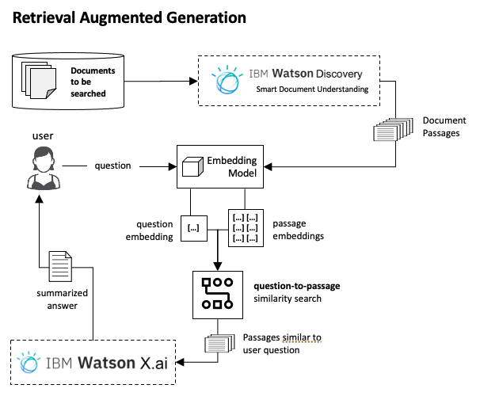

# Retrieval Augment Generation (RAG) for Contextual and Timely Answers

### Introduction
In this lab, you will apply Retrieval Augment Generation (RAG) to retrieve then summarize text based on user queries.  Here is a high level view of a RAG implementation.  

  

You will not use Watson Discovery, however, in most document-heavy uses cases. Typically, you use Smart Document Understanding in Watson Discovery to extract passaged from documents.  For the following two simplified labs, you will first apply RAG to identify passages within a document that match a user's query.  You will then apply RAG across a large dataset of passages to identify then summarize text to answer a quesions.  You will learn how to evaluate the performance of the RAG passage retrieval technique.

Part A[RAG principles using PDFs](./watsonx-rag.ipynb)

Part B
  - [Go to home page of watsonx](https://dataplatform.cloud.ibm.com/wx/home?context=wx)
  - Scroll down and click on "View all" Samples
  - Search for Langchain
  - Select the first sample (Use watsonx, and LangChain to make a series of calls to a language model)

