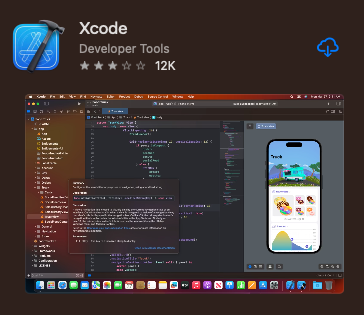
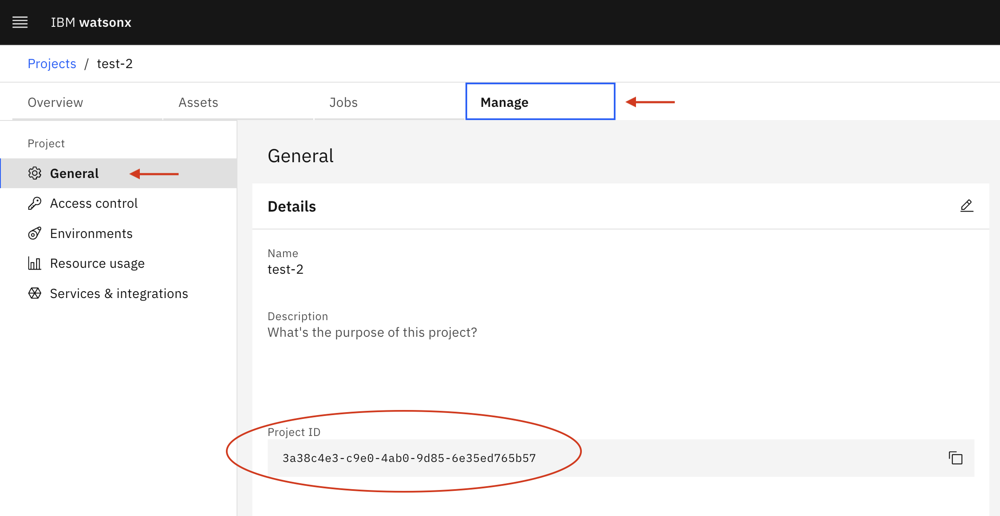
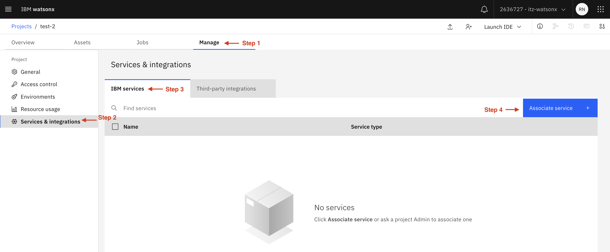
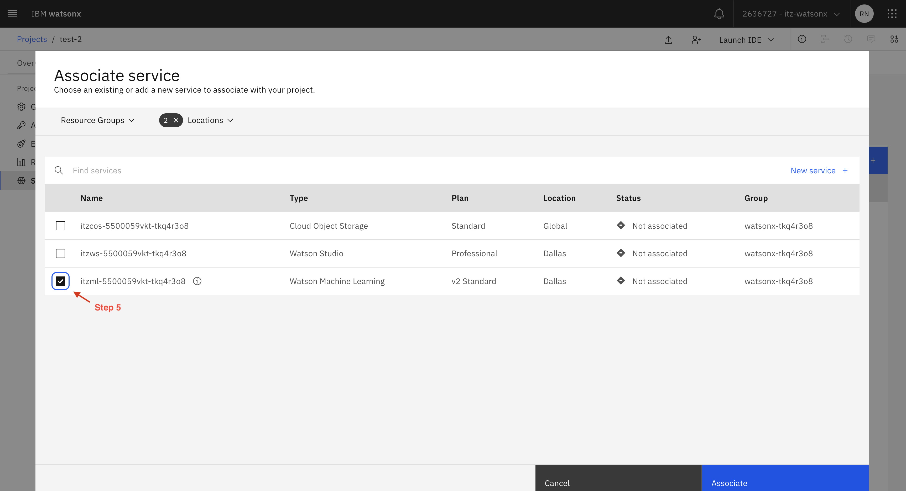

# Desktop Environment Setup

## Introduction
Complete the steps in this guide to ensure your desktop environment has all the required tools and libraries installed.

## Steps to complete
- [Desktop Environment Setup](#desktop-environment-setup)
  - [Introduction](#introduction)
  - [Steps to complete](#steps-to-complete)
    - [0: (For Mac Users Only) Install/Update Xcode ](#0-for-mac-users-only-installupdate-xcode-)
    - [1: Connect to watsonx.ai ](#1-connect-to-watsonxai-)
    - [2: Create a watsonx.ai Project ](#2-create-a-watsonxai-project-)
    - [3: Associate your project with a WML instance ](#3-associate-your-project-with-a-wml-instance-)
    - [4: Obtain your IBM Cloud API key ](#4-obtain-your-ibm-cloud-api-key-)
    - [5: Clone the Workshop's Github repo ](#5-clone-the-workshops-github-repo-)
    - [6: Create Virtual Python Environment and Install Jupyter and Required Libraries ](#6-create-virtual-python-environment-and-install-jupyter-and-required-libraries-)
    - [7: Choose your Jupyter Notebook Runtime](#7-choose-your-jupyter-notebook-runtime)
      - [7a: Run Jupyter Server and Validate All Libraries Installed](#7a-run-jupyter-server-and-validate-all-libraries-installed)
      - [7b: Install Visual Studio Code (VS Code) ](#7b-install-visual-studio-code-vs-code-)
    - [8: Validate All Libraries Installed ](#8-validate-all-libraries-installed-)
    - [9: Security and .env Files](#9-security-and-env-files)
    - [10: .gitignore Files ](#10-gitignore-files-)

### 0: (For Mac Users Only) Install/Update Xcode <a id="install-update-xcode"></a>
Setting up your environment via the steps below can reveal various distinct problems, several of which will be the result of not having your Mac properly setup for development. Xcode is a collection of developer tools that enable building applications for Apple's various operating systems (MacOS, iOS, etc) but also comes with some command line tools and a C compiler. The latter are necessary to install some of the dependencies for this training.

❗ Updating Xcode takes several hours! Do this first, and go make some coffee... ❗

Access the App Store (Not the Mac@IBM App Store!) and search for "xcode." Click the "Get" button or the Cloud icon to install the latest version.



### 1: Connect to watsonx.ai <a id="connect-to-watsonxai"></a>
Try connecting to [watsonx.ai](https://dataplatform.cloud.ibm.com/wx/). **Importantly**, you will primarily visit the watsonx.ai UI for labs that require the Prompt Lab, which provides a more interactive user interface. The majority of the labs involve interacting with watsonx.ai *programmatically* via the new [Foundation Models module](https://ibm.github.io/watson-machine-learning-sdk/foundation_models.html) of the [Watson Machine Learning Python SDK](https://pypi.org/project/ibm-watson-machine-learning/). While this library works from within the watsonx.ai UI, this workshop was designed such that you will run Python code from VS Code on your local machine, which still submits inference requests to the GA instance of watsonx.ai.

### 2: Create a watsonx.ai Project <a id="create-project"></a>
The Watson Machine Learning Python SDK requires a project ID to interact with watsonx.ai LLMs. How you obtain this project ID depends on whether you are part of an instructor-led workshop, or are taking the workshop on your own. See below for your specific scenario:

**If you are part of an instructor-led workshop:**
1. Your instructor will provide you with the project ID. You will need this project ID for [step 8](#environment-files).

**If you are taking this workshop on your own:**
1. Visit the [watsonx.ai Projects page](https://dataplatform.cloud.ibm.com/projects/?context=wx) and click "Create an empty project". Give your project a valid name, and leave the remaining default options. Click "Create" and verify that your project was successfully created.
2. Once your new project loads, select the "Manage" tab from the Project's main page. You will see your Project ID under the "General" tab as shown below. You will need this project ID for [step 8](#environment-files).

<p align="left">
  
</p>

### 3: Associate your project with a WML instance <a id="wml-instance"></a>
A watsonx.ai project must *always* be associated with an instance of Watson Machine Learning (WML) before you can use the Prompt Lab or interact with the WML Python SDK.

**If you are part of an instructor-led workshop:**
1. The project was created for you, and no further action is required (i.e., an instance of WML should already be associated with the project)

**If you are taking this workshop on your own:**
1. Within your newly created watsonx.ai project, click the `Manage` tab
2. Select `Services & integrations` from the side navigation menu
3. Select the `IBM Services` tab
4. Select `Associate service +`
5. Choose a WML instance and select `Associate`

<p align="left">
  
</p>

<p align="left">
  
</p>

### 4: Obtain your IBM Cloud API key <a id="obtain-api-key"></a>
You will need your IBM Cloud API key to authenticate the Watson Machine Learning Python SDK client and interact with watsonx.ai foundation models. **Note that this is the conventional IBM Cloud API key, which you may have already created in the past.** Use your existing API key or follow [these instructions](https://cloud.ibm.com/docs/account?topic=account-userapikey&interface=ui#create_user_key) to generate a new one in the [IBM cloud console](https://cloud.ibm.com). You will need this API key for [step 8](#environment-files).

### 5: Clone the Workshop's Github repo <a id="clone-watsonxai-repo"></a>
If you're a Github pro then you can directly clone this wastonx.ai workshop repo. Otherwise we recommend downloading and installing the [Github Desktop](https://desktop.github.com/) and then cloning this watsonx.ai workshop repo. Here are instructions on [how to clone a repository using Github Desktop](https://docs.github.com/en/desktop/contributing-and-collaborating-using-github-desktop/adding-and-cloning-repositories/cloning-a-repository-from-github-to-github-desktop).

### 6: Create Virtual Python Environment and Install Jupyter and Required Libraries <a id="virtual-environment"></a>
Python applications import multiple libraries, and oftentimes, conflicts can occur between different versions of required libraries. However, your app may require a specific library version due to a bug fix. The solution is to create a virtual environment, a self-contained suite of libraries for a specific Python installation.

To ensure all required Python libraries are installed, [complete these steps to create your virtual Python environment.](create-virtual-python-environment.md)

**NOTE:** Don't skip setting up your Python environment as the documented steps ensure you have installed the Watson Machine Learning Python SDK, Jupyter Notebook, ChromaDB, Hugging Face and all other required libraries.

### 7: Choose your Jupyter Notebook Runtime<a id="jupyter-runtime"></a>
In order to use Jupyter notebooks, there are a few choices.

A Jupyter server can be installed and run locally very easily. Jupyter notebooks can also be run in VS Code using a plugin. It's up to you which you prefer. If in doubt, VS Code is a simple solution with which many data scientists are familiar.

#### 7a: Run Jupyter Server and Validate All Libraries Installed<a id="jupyter-notebook"></a>
You will be executing several Jupyter notebooks during this workshop. The Jupyter Notebook executable was installed as part of your Virtual Environment setup in [Step #6](create-virtual-python-environment.md).

Before executing the command below, choose the root directory for the server. When the server starts, your current working directory will become the server's root directory. In its user interface, you won't be able to access files above that directory. If you would like to focus only on these labs, choose the root of the repo directory. Otherwise, you could choose something higher like the directory in which you store all of your repos or your Documents folder, for instance.

```
# ensure your python virtual environment is active
cd <directory chosen as server's root directory>
jupyter notebook
```

Jupyter should automatically open a browser window for you. If not, navigate to http://localhost:8888/notebooks/ to run the notebook.

#### 7b: Install Visual Studio Code (VS Code) <a id="vs-code"></a>
Most development and data science teams within IBM (and outside) have selected VS Code as their default coding environment. You can choose to use an alternate IDE for this Boot Camp (like PyCharm or Eclipse), however the Boot Camp coaches will be less skilled at supporting those IDEs. We recommend installing VS Code so you are on a common platform with most of your IBM colleagues.

Go here to [install VS Code and configure it for your Python environment](vs-code.md)

### 8: Validate All Libraries Installed <a id="validate-libraries"></a>

Download this [environment test notebook](./environment-test.ipynb) or use the one in your cloned version of this Github repository. Access the notebook in your chosen Jupyter runtime and execute it entirely. If no errors appear, your dependencies have been installed!

### 9: Security and .env Files<a id="environment-files"></a>
A guaranteed way to get contacted by IBM's Github security team is to check-in code that contains an access credential for an IBM Cloud service. To avoid this, store credentials in a .env file, then ensure this .env **is not checked into Github.** Python provides support for .env files through a library called dotenv that you will encounter during some lessons in this Boot Camp.

Download this [env file](./env), open it in a text editor and 
1. add your IBM Cloud API key from [step 4](#obtain-api-key) in the API_KEY field
2. add your project ID from [step 2](#create-project) in the PROJECT_ID field

Add a period to the downloaded "env" file to it is ".env". You may get a warning that this will convert this to a hidden file so [learn how to view these hidden files on a Mac](https://www.macworld.com/article/671158/how-to-show-hidden-files-on-a-mac.html) or [how to view hidden files on Windows](https://support.microsoft.com/en-us/windows/view-hidden-files-and-folders-in-windows-97fbc472-c603-9d90-91d0-1166d1d9f4b5).

If you are still having trouble renaming the “env” file to “.env”, type the following commands in your terminal:
```
cd <path to folder containing your env file>
mv env .env
```
To check that the file was changed to .env, type the following command: 
```
ls -la 
```

### 10: .gitignore Files <a id="gitignore"></a>
Whenever checking code into a Github repo, use .gitignore to exclude files from being checked-in. If you don't know how to do this, [learn how to add your .env to .gitignore](https://salferrarello.com/add-env-to-gitignore/).
