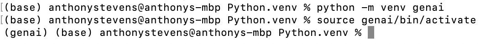

# Create Virtual Python Environment
Python applications import multiple libraries, and oftentimes, conflicts can occur between different versions of required libraries.  However your app may require a specific library version due to a bug fix.  The solution is to create a virtual environment, a self-contained suite of libraries for a specific Python installation.

We will use Python's built-in virtual environment functionality which was introduced in Python version 3.3 and provides [a built-in environments module called venv](https://docs.python.org/3/tutorial/venv.html).  You may be asking why we aren't using Conda.  The reason is that [Conda/Miniconda is now on IBM's "do-not-use" list](https://w3.ibm.com/w3publisher/ossc-process/exception-and-do-not-use) because of use of the Anaconda repo.

While creating your virtual Python environment below, you will also be installing all the libraries required to complete this Boot Camp including Jupyter Notebooks, the Watson Machine Learning Python SDK, Hugging Face libraries, ChromaDB and LangChain.

#### Upgrade to Python v3.11 to Avoid Any Conflicts
Upgrading Python versions can be complicated so don't be afraid to ask for help during this process.  We have documented best practices to assist you.  You may have no issues using Python 3.8 plus, but recall that even Python 3.9 is 2.5 years old.  [Follow these best practices to upgrade to Python 3.11](upgrade-python.md).

#### Create your Python virtual environment
Create a folder where you will create and store your Python virtual environment.  Then open a terminal/console window and enter the commands below to create a Python environment called `genai`. The new virtual environment will result in a local directory by the same name.
```
cd <directory to store your Python environment>
python -m venv genai
```

#### Download requirements_venv.txt
Download [requirements_venv.txt](./requirements_venv.txt) which contains the list of initial packages to install in your environment.  Move the requirements.txt file to the folder that you created for your Python environments.

#### Activate your Python virtual environment
Execute these commands:
```
source genai/bin/activate
python -m pip install -r requirements_venv.txt
```

You can validate that your environment is active by looking at the start of the prompt line in your terminal/console window.  As shown below, the start of the prompt changes to show (genai).

<p align="left">
  
</p>

Note: If you are a Windows user, instead of running the command `source genai/bin/activate`, follow the steps in [Setting-up-Python-Virtual-Environment-in-Windows.docx](./Setting-up-Python-Virtual-Environment-in-Windows.docx). 

Note: If you do not have an M1 chip, you might get an error along the lines of:
```
× Building wheel for chroma-hnswlib (pyproject.toml) did not run successfully.
```
If so, try one of these two solutions, replacing `python -m pip install -r requirements_venv.txt` with
```
export HNSWLIB_NO_NATIVE=1
python -m pip install -r requirements_venv.txt
```
or
```
ARCHFLAGS="-arch x86_64" python -m pip install -r requirements_venv.txt
```

#### Dectivate your Python virtual environment
If you need to change to a different environment, you can deactivate your current environment using the command below:
```
deactivate
```
